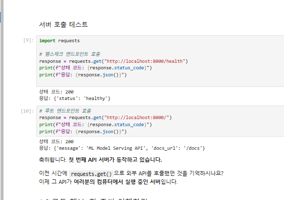
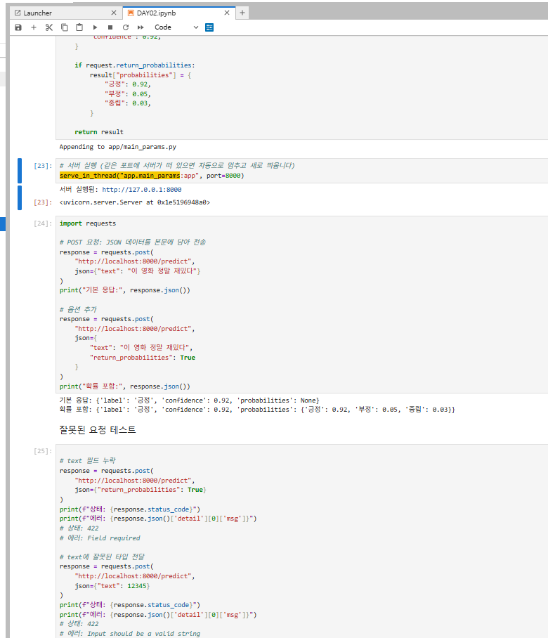
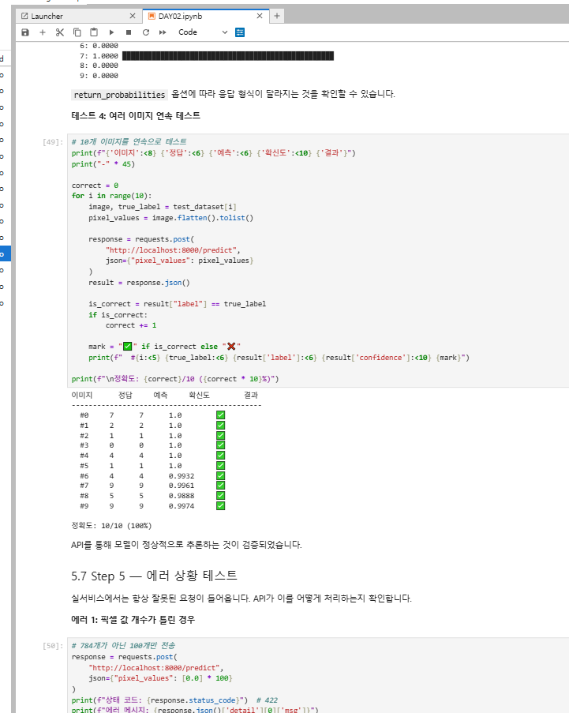

# Day 2 — FastAPI 기초와 데이터 처리 실습 제출

> 작성자: 김범수  
> 날짜: 2026-06-10  
> 환경: Windows 11, Python 3.x, FastAPI + Uvicorn

---

## 1. 섹션 1.5 수행내역

> 최소한의 FastAPI 서버 실행 실습

<!-- 섹션 1.5 실행 결과 캡처 이미지를 여기에 추가하세요 -->

---

## 2. 섹션 2, 3 셀 출력

> Path/Query/Body 파라미터 및 Swagger UI 실습

<!-- 섹션 2, 3 실행 결과 캡처 이미지를 여기에 추가하세요 -->

---

## 3. 섹션 5 수행내역

> 모델 추론 엔드포인트 구현 및 테스트

<!-- 섹션 5 실행 결과 캡처 이미지를 여기에 추가하세요 -->

---

## 4. 체크포인트 답변

### ✅ 섹션 1 체크포인트

**Q1. FastAPI가 Flask보다 모델 배포에 적합한 이유 세 가지는?**

① **자동 입력 검증(Pydantic)**: 타입 힌트만 작성하면 잘못된 요청을 422로 자동 차단하여, 별도 검증 코드 없이도 모델에 잘못된 데이터가 도달하는 것을 막는다.  
② **자동 API 문서(Swagger UI)**: `/docs`에 접속하면 코드와 항상 동기화된 인터랙티브 문서가 자동 생성되어, 별도 문서 작성 없이 바로 테스트 가능하다.  
③ **비동기 처리(async/await)**: 비동기 기반으로 여러 요청을 동시에 처리할 수 있어, 모델 추론 대기 중에도 다른 요청을 받을 수 있다.

**Q2. Uvicorn의 역할은 무엇이며 왜 FastAPI와 함께 사용합니까?**

Uvicorn은 ASGI 서버로, FastAPI 앱을 실제로 실행시켜 HTTP 요청을 받고 응답을 보내는 역할을 한다. FastAPI는 앱 로직만 정의하고, 실제 네트워크 통신은 Uvicorn이 담당하기 때문에 함께 사용한다.

**Q3. `@app.get("/health")`에서 `get`과 `"/health"`는 각각 무엇을 의미합니까?**

`get`은 HTTP 메서드(GET)를 의미하며 데이터 조회 요청에 사용한다.  
`"/health"`는 URL 경로(엔드포인트)로, `http://localhost:8000/health`로 요청이 왔을 때 이 함수가 실행된다.

**Q4. FastAPI에서 dict를 반환하면 어떤 일이 자동으로 일어납니까?**

FastAPI가 dict를 자동으로 JSON으로 변환하여 `Content-Type: application/json` 헤더와 함께 응답한다. 별도의 직렬화 코드가 필요 없다.

---

### ✅ 섹션 2 체크포인트

**Q1. `/models/sentiment-v1`에서 `sentiment-v1`은 어떤 종류의 파라미터입니까?**

**Path 파라미터**. URL 경로 자체에 포함된 값으로, `@app.get("/models/{model_name}")`처럼 중괄호로 선언하며 필수값이다.

**Q2. `/models?status=running&limit=5`에서 `status`와 `limit`은 어떤 종류의 파라미터입니까?**

**Query 파라미터**. URL 뒤 `?` 이후에 `key=value` 형태로 전달되며, 함수의 기본값이 있으면 선택적으로 사용된다.

**Q3. 모델 추론 요청에 Request Body를 사용하는 이유는 무엇입니까?**

텍스트, 픽셀 배열 등 크거나 구조화된 데이터는 URL에 담을 수 없기 때문이다. Body는 JSON 형태로 전송되어 복잡한 입력 구조를 표현할 수 있고, Pydantic 모델로 자동 검증도 가능하다.

**Q4. FastAPI에서 파라미터가 Path/Query/Body 중 어디서 오는지 어떻게 판별합니까?**

- URL 경로에 `{변수명}`이 있으면 → **Path**  
- 함수 파라미터가 기본 타입(`str`, `int`)이고 경로에 없으면 → **Query**  
- 함수 파라미터가 `BaseModel`을 상속한 Pydantic 클래스면 → **Body**

---

### ✅ 섹션 3 체크포인트

**Q1. Swagger UI에 접속하려면 어떤 URL로 이동합니까?**

`http://localhost:8000/docs`

**Q2. Swagger UI가 코드와 항상 동기화될 수 있는 이유는 무엇입니까?**

Swagger UI는 FastAPI가 코드를 분석해 자동 생성한 `openapi.json`(JSON Schema)을 읽어서 렌더링하기 때문이다. 코드가 바뀌면 스키마도 즉시 바뀌므로, 문서를 별도로 관리할 필요가 없다.

**Q3. `Field(description=, examples=)`는 Swagger UI의 어디에 반영됩니까?**

`description`은 각 필드 옆에 설명 텍스트로, `examples`는 Request Body 입력창의 예시값으로 표시된다.

**Q4. Swagger UI와 ReDoc의 핵심 차이는 무엇입니까?**

Swagger UI(`/docs`)는 **Try it out** 버튼으로 직접 API를 호출해볼 수 있는 인터랙티브 문서이다.  
ReDoc(`/redoc`)은 읽기 전용 참조 문서로 가독성이 높지만 직접 테스트는 불가능하다.

---

### ✅ 섹션 4 체크포인트

**Q1. `text: str`과 `text: str = "기본값"`의 차이는?**

`text: str`은 **필수 필드**로, 값이 없으면 422 에러가 발생한다.  
`text: str = "기본값"`은 **선택적 필드**로, 값이 없으면 "기본값"이 자동으로 사용된다.

**Q2. `Field(..., min_length=1)`에서 `...`은 무엇을 의미합니까?**

`...`(Ellipsis)는 파이썬에서 **"필수"** 를 의미한다. 기본값 없이 반드시 입력해야 한다는 표시이다.

**Q3. 422 에러 응답에서 `loc` 필드는 어떤 정보를 담고 있습니까?**

에러가 발생한 위치를 나타낸다. 예: `["body", "text"]`는 요청 본문(body)의 `text` 필드에서 오류가 났다는 의미이다.

**Q4. `response_model`을 지정하면 어떤 이점이 있습니까?**

① Swagger UI에 응답 스키마가 자동 문서화된다.  
② 스키마에 없는 필드는 응답에서 자동 제거되어 내부 데이터가 실수로 노출되지 않는다.  
③ 응답 데이터의 타입 안정성이 보장된다.

---

### ✅ 섹션 5 체크포인트

**Q1. 모델을 서버 시작 시 한 번만 로드해야 하는 이유는?**

모델 로드는 파일 I/O가 포함된 무거운 작업으로 수 초가 소요된다. 요청마다 로드하면 매 추론마다 수 초의 지연이 생겨 실서비스에서 사용할 수 없다. 서버 시작 시 1회만 로드하고 메모리에 유지하면, 이후 요청은 즉시 처리된다.

**Q2. pixel_values가 784개가 아닌 요청이 들어오면 어떤 일이 발생합니까?**

Pydantic의 `Field(min_length=784, max_length=784)` 조건에 의해 검증이 자동으로 실패하고, FastAPI가 **422 Unprocessable Entity** 에러를 반환한다. 별도의 검증 코드를 작성하지 않아도 Pydantic이 자동으로 처리한다.  
실습에서 100개 전송 시: `"List should have at least 784 items after validation, not 100"` 메시지 확인.

**Q3. HTTPException(status_code=503)은 어떤 상황에서, 왜 500이 아닌 503입니까?**

모델 로드에 실패한 상태에서 추론 요청이 들어올 때 사용한다.  
500(Internal Server Error)은 서버 내부 코드 오류를 의미하지만,  
503(Service Unavailable)은 서버는 살아있으나 현재 서비스를 제공할 수 없는 상태를 의미한다.  
모델 미로드는 코드 버그가 아니라 일시적인 서비스 불가 상태이므로 503이 더 정확하다.

**Q4. Swagger UI에서 description과 examples는 어디에 표시됩니까?**

`description`은 각 필드 옆 설명 텍스트로 표시되고, `examples`는 **Try it out** 클릭 시 Request Body 입력창에 예시 JSON으로 자동 채워진다.
