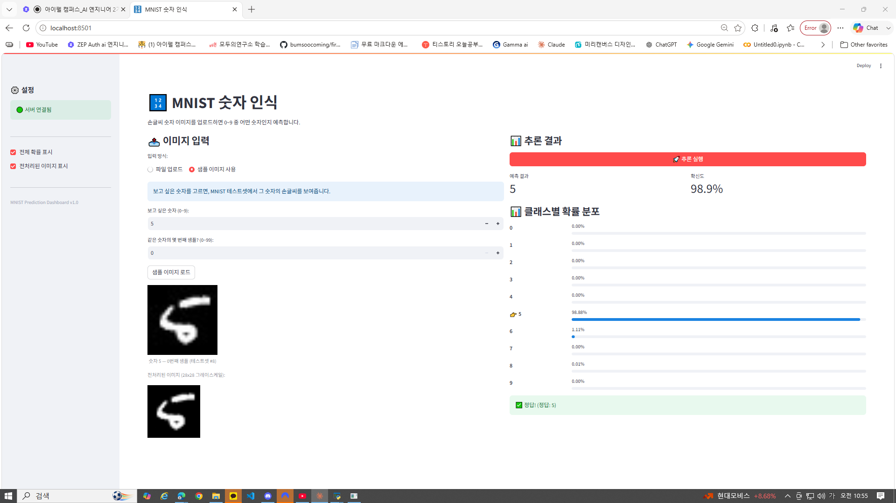
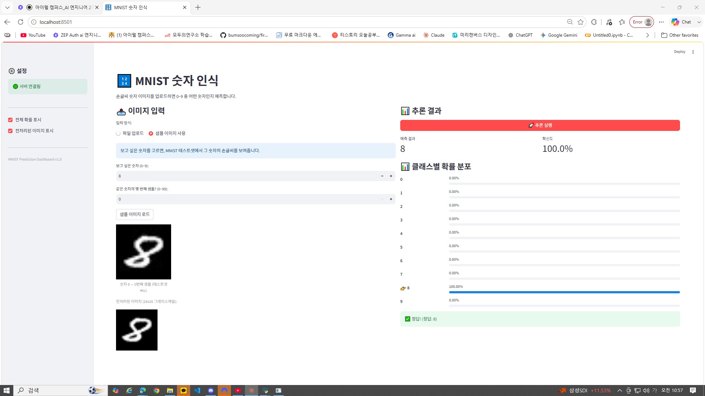

# Day 4 — Streamlit 프론트엔드 & 시스템 아키텍처 실습 제출

> 작성자: 김범수
> 날짜: 2026-06-12
> 환경: Windows 10, Python 3.x (.venv), Streamlit 1.38.0 + FastAPI

---

## 1. 실습 개요

개발자 전용이던 추론 API에 **'얼굴'(웹 UI)** 을 달았습니다.
Streamlit으로 프론트엔드를 만들고, Day 1~3에서 완성한 FastAPI 백엔드를 **HTTP로 호출**하는
**분리 아키텍처**를 구현했습니다.

```
Streamlit (8501)  ──HTTP──▶  FastAPI (8000)  ──▶  모델 파일
  UI·업로드·시각화            검증·전처리·추론·로깅      가중치
```

---

## 2. 실습 결과 (섹션 5 대시보드)

실제 MNIST 추론 대시보드를 완성하고, 샘플 이미지로 추론을 검증했습니다.

| 입력 | 예측 | 확신도 | 결과 |
|------|------|--------|------|
| 숫자 5 손글씨 | **5** | 98.9% | ✅ 정답 |
| 숫자 8 손글씨 | **8** | 100.0% | ✅ 정답 |

**대시보드 캡처 1 — 숫자 5 (확신도 98.9%)**



**대시보드 캡처 2 — 숫자 8 (확신도 100%)**



전체 흐름이 정상 동작함을 확인:
```
① 이미지 입력(샘플/업로드) → ② Base64 인코딩 → ③ POST /predict/image
→ ④ 백엔드 디코딩·전처리·추론 → ⑤ session_state 저장 → ⑥ metric·확률막대 시각화
```

> 백엔드에 Base64 이미지를 받는 `/predict/image` 엔드포인트를 추가하여 대시보드와 연동했습니다.
> (Day 1~3 코드는 수정하지 않고, 이미지 입구만 새로 추가)

---

## 3. 체크포인트 답변

### ✅ §1 체크포인트

**Q1. Streamlit의 스크립트 재실행 모델이란 무엇입니까?**

사용자가 위젯을 조작(클릭·입력)할 때마다, Streamlit이 `app.py` 스크립트를 **처음부터 끝까지 위에서 아래로 다시 실행**하는 동작 방식입니다. 일반 웹 프레임워크가 해당 이벤트 핸들러만 실행하는 것과 달리, Streamlit은 화면 전체를 매번 새로 그립니다. 이 때문에 비싼 객체는 캐시로, 결과는 session_state로 지켜야 합니다.

**Q2. `st.text_input()`에 값을 입력하면 내부적으로 어떤 일이 일어납니까?**

값을 입력하는 순간 스크립트 전체가 재실행되고, 재실행되며 `st.text_input()`이 **지금 입력된 값을 반환**합니다. 그 반환값이 변수에 담겨, 아래 코드가 새 값으로 다시 그려집니다. 복잡한 이벤트 연결 없이 평범한 스크립트가 인터랙션이 되는 비결입니다.

**Q3. `st.set_page_config()`를 스크립트 중간에 호출하면 어떻게 됩니까?**

에러가 발생합니다. `set_page_config()`는 **반드시 스크립트의 가장 첫 번째 Streamlit 호출**이어야 합니다. 재실행 모델 특성상 페이지 설정(탭 제목·아이콘·레이아웃)은 맨 위에서 한 번만 정해져야 하기 때문입니다.

---

### ✅ §2 체크포인트

**Q1. `st.file_uploader()`로 업로드된 파일의 바이트 데이터는 어떻게 얻습니까?**

업로드 위젯이 돌려준 파일 객체에서 `.getvalue()`를 호출하면 파일의 **원본 바이트**를 얻습니다. 단, 업로드 전에는 위젯이 `None`을 반환하므로, `if uploaded is not None:`(또는 `if uploaded:`)으로 먼저 감싸야 첫 화면에서 에러가 나지 않습니다. 얻은 바이트는 §4에서 Base64로 변환해 API로 전송합니다.

**Q2. Streamlit에서 `@st.cache_resource`를 사용하는 이유는 무엇입니까?**

재실행 모델 때문에 스크립트가 매번 다시 도는데, DB 연결·HTTP 세션·ML 모델처럼 **복사하면 안 되고 생성 비용이 큰 객체**를 매 재실행마다 다시 만들면 앱이 느려집니다. `@st.cache_resource`는 그 객체를 **최초 1회만 생성하고 이후엔 모두가 같은 객체를 공유**하게 해줍니다. (값으로 굳힐 수 있는 데이터는 `cache_data`, 살아있는 객체는 `cache_resource`로 구분합니다. 이 과정에선 모델을 FastAPI가 들고 있어 프론트는 API 클라이언트 정도만 캐시합니다.)

---

### ✅ §4 체크포인트

**Q1. 이미지를 API에 전송할 때 Base64로 인코딩하는 이유는 무엇입니까?**

JSON은 **텍스트 형식**인데 이미지는 **이진(binary) 데이터**입니다. JSON 값은 문자열·숫자·참거짓·배열·객체뿐이라 원시 바이트를 그대로 넣을 수 없습니다. Base64는 3바이트를 안전한 영문·숫자 4글자로 바꿔 **바이트를 텍스트로 옮기는 다리** 역할을 합니다. 단, 인코딩 결과는 아직 바이트열이므로 `.decode("utf-8")`까지 해야 진짜 문자열이 되어 JSON에 들어갑니다. (대가는 약 33% 부피 증가)

**Q2. `response.raise_for_status()`는 어떤 역할을 합니까?**

응답 상태 코드가 **4xx/5xx(실패)** 이면 `HTTPError` 예외를 발생시킵니다. 연결은 됐지만 422·500 같은 에러 코드가 온 경우를 잡아내, `try/except`에서 사용자에게 적절한 안내 메시지를 띄울 수 있게 합니다. Day 2에서 배운 상태 코드가 여기서 클라이언트의 분기 기준이 됩니다.

---

## 4. 오늘 완성한 것

```
✅ Streamlit의 기본 개념과 재실행 모델 이해
✅ 프론트-백엔드 분리 아키텍처의 이유와 구조 이해
✅ Streamlit에서 FastAPI 호출 + Base64 전송 + 에러 처리
✅ MNIST 추론 대시보드 완성 (업로드 → 추론 → 시각화)
✅ 백엔드에 /predict/image 엔드포인트 추가 (Base64 이미지 입구)
```

**가장 중요한 변화:** 개발자만 쓰던 API가, 이미지를 드래그하면 결과가 나오는 **누구나 쓰는 화면**이 되었습니다.

**다음 — Day 5:** 정형 데이터(CSV) 기반 예측 서비스를 처음부터 끝까지 구축
