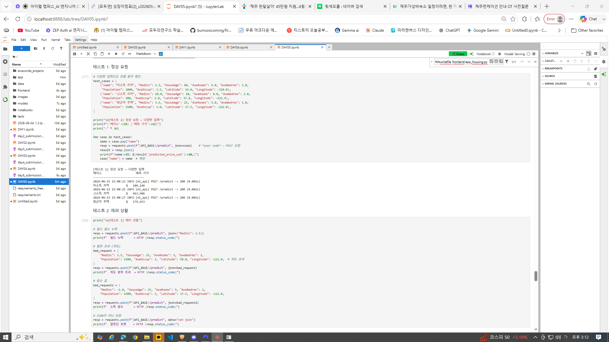
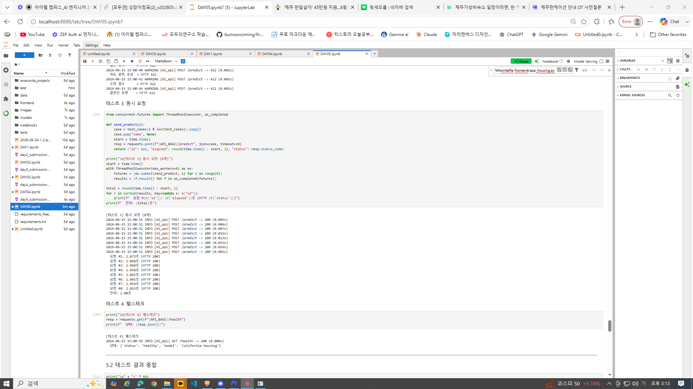

# Day 5 — [프로젝트 1] 정형 데이터 예측 서비스 제출

> 작성자: 김범수
> 날짜: 2026-06-15
> 환경: Windows 10, Python 3.x (.venv), PyTorch + FastAPI + Streamlit
> 데이터셋: California Housing (scikit-learn 내장)

---

## 1. 프로젝트 실행 내역 및 설명

Day 1~4까지 MNIST(이미지)로 익힌 조각들을, **정형 데이터(CSV)** 예측 서비스로
처음부터 끝까지 통합했습니다.

```
Streamlit (입력 폼) → FastAPI (추론 API) → PyTorch 회귀 모델 (주택 가격 예측)
```

### 새로 만든 파일 (housing_ 접두사로 MNIST와 분리)
```
app/housing_model.py     — 모델 정의 + HousingPredictor(추론 함수)
app/housing_schemas.py   — HousingRequest / HousingResponse (Pydantic)
app/housing_api.py        — 주택 가격 FastAPI 서버
frontend/app_housing.py   — 주택 가격 Streamlit 대시보드
models/housing_model.pth          — 학습된 가중치
models/housing_preprocessing.json — 전처리 파라미터(mean/std)
```

> ※ Day 3에서 만든 인프라 모듈 이름이 달라(`logger.py` 등) housing_api가 import하는
> `app/logger_config.py`, `app/middleware.py`(RequestLoggingMiddleware),
> `register_error_handlers`를 호환 모듈로 추가했습니다. (기존 MNIST 서버는 그대로 유지)

### 실행 결과 (섹션 5 통합 테스트)

**테스트 1 — 다양한 지역 추론** (입력에 따라 합리적으로 가격이 달라짐)
| 입력 유형 | 예측 가격 |
|-----------|-----------|
| 저소득 지역 | $104,146 |
| 평균적 주택 | $179,653 |
| 고소득 지역 | $463,986 |

**테스트 2 — 에러 상황** (4가지 모두 차단)
```
필드 누락      → HTTP 422
위도 범위 초과  → HTTP 422
소득 음수      → HTTP 422
잘못된 포맷    → HTTP 422
```

**테스트 3 — 동시 8개 요청** (Day 3 비동기 패턴)
```
요청 #1~#8: 각 ~2.05초,  전체: 2.08초
→ 순차였다면 16초, run_in_executor 덕에 2초에 처리
```

**테스트 4 — 헬스체크**
```
{'status': 'healthy', 'model': 'California Housing'}
```

종합:
```
✅ 정상 요청: 다양한 입력에서 합리적인 가격 반환
✅ 에러 처리: 잘못된 입력 422/400 반환, 서버 안 죽음
✅ 동시 처리: 8개 동시 요청 정상 처리 (2.08초)
✅ 헬스체크: 서버 상태 정상
```

**실행 캡처 1 — 테스트 1(지역별 추론) + 테스트 2(에러 422)**



**실행 캡처 2 — 테스트 3(동시 8개 2.08초) + 테스트 4(헬스체크) + 종합**



---

## 2. 섹션별 체크포인트 답변

### ✅ §1 체크포인트

**Q1. 이 프로젝트의 입력과 출력은 각각 무엇입니까?**
입력은 주택 정보 8개 피처(중위소득, 주택연식, 평균 방·침실 수, 인구, 평균 거주인원, 위도, 경도)이고, 출력은 예측된 주택 중위 가격($100,000 단위 및 USD)입니다.

**Q2. MNIST 프로젝트와 비교했을 때, 데이터 형태가 어떻게 다릅니까?**
MNIST는 28×28 픽셀 **이미지(비정형, 784차원)** 였고, 이번은 8개의 숫자 컬럼으로 된 **정형 데이터(CSV/표)** 입니다. 입력이 구조화되어 있어 **스키마 설계(필드별 타입·범위 검증)** 가 더 중요해집니다. 또한 분류가 아니라 연속값을 예측하는 **회귀** 문제입니다.

**Q3. 오늘 새로 만들 파일 3개의 이름과 역할을 말할 수 있습니까?**
`housing_model.py`(모델 정의 + 추론 함수), `housing_schemas.py`(API 입출력 Pydantic 스키마), `housing_api.py`(주택 가격 FastAPI 서버)입니다.

---

### ✅ §2 체크포인트

**Q1. 정규화에서 학습 데이터의 통계를 테스트 데이터에도 사용하는 이유는 무엇입니까?**
모델이 학습한 기준(학습 데이터의 mean/std)과 추론 시 입력의 기준이 같아야 하기 때문입니다. 테스트 데이터의 통계로 다시 정규화하면 학습 때와 다른 스케일이 되어 예측이 왜곡되고, **테스트 데이터 정보가 새어 들어가는(data leakage)** 문제도 생깁니다. 실서비스에서는 요청 1건씩 들어오므로 그 자체의 통계를 낼 수도 없습니다.

**Q2. 모델 가중치 외에 함께 저장해야 하는 것은 무엇이고, 왜 필요합니까?**
**전처리 파라미터(각 피처의 mean·std)** 를 `housing_preprocessing.json`으로 함께 저장합니다. 추론 시 입력을 학습 때와 **똑같은 방식으로 정규화**해야 하는데, 그 기준값이 없으면 같은 모델이라도 엉뚱한 결과가 나오기 때문입니다. 모델과 전처리는 한 세트로 배포해야 합니다.

**Q3. `HousingPredictor.predict()`에서 피처를 `self.feature_names` 순서로 배열하는 이유는?**
모델은 입력 벡터의 **위치(순서)로 각 피처를 인식**합니다. 학습 때와 다른 순서로 값을 넣으면, 예컨대 '소득' 자리에 '위도'가 들어가 완전히 잘못된 예측을 합니다. 딕셔너리로 받은 입력을 항상 학습 때의 컬럼 순서로 정렬해야 안전합니다.

---

### ✅ §3 체크포인트

**Q1. `HousingRequest`에서 `Latitude`에 `ge=32, le=42` 제한을 넣은 이유는?**
캘리포니아의 위도 범위가 약 32~42도이기 때문입니다. 이 범위를 벗어난 좌표는 데이터셋이 학습하지 않은 영역이라 의미 없는 예측이 나옵니다. Pydantic 단계에서 미리 막아 **잘못된 입력이 모델에 도달하기 전에 422로 차단**합니다.

**Q2. `request.model_dump()`는 어떤 역할을 합니까?**
Pydantic 모델 객체를 **일반 Python 딕셔너리로 변환**합니다. 검증을 통과한 요청을 `{"MedInc": ..., "HouseAge": ...}` 형태로 바꿔, 추론 함수(`predictor.predict`)에 그대로 넘길 수 있게 합니다.

**Q3. `run_in_executor`를 사용하지 않으면 어떤 문제가 발생할 수 있습니까?**
추론은 CPU-bound 작업이라 `async` 핸들러 안에서 직접 실행하면 **이벤트 루프를 붙들어** 그동안 다른 요청과 헬스체크까지 모두 멈춥니다(Day 3의 함정). `run_in_executor`로 추론을 별도 스레드풀에 위임해야 루프가 자유로워져 동시 요청을 처리할 수 있습니다.

---

### ✅ §4 체크포인트

**Q1. MNIST 대시보드(Day 4)와 비교했을 때 입력 방식이 어떻게 다릅니까?**
MNIST는 **이미지 파일 업로드(file_uploader) → Base64 인코딩**이었지만, 이번은 8개 피처를 **숫자 입력 위젯(`st.number_input`)** 으로 직접 받아 **JSON으로** 보냅니다. 이미지 인코딩 과정이 없고, 입력 폼 설계가 핵심이 됩니다.

**Q2. `st.number_input()`에서 `min_value`, `max_value`를 설정하는 이유는?**
사용자가 비현실적인 값(음수 소득, 캘리포니아 밖 좌표 등)을 넣지 못하도록 **화면에서 1차로 막기** 위함입니다. UX가 좋아지고, 서버로 잘못된 요청이 가는 횟수도 줄어듭니다. (진짜 검증은 백엔드 Pydantic이 최종 담당)

**Q3. `request_data` 딕셔너리의 키 이름이 `HousingRequest` 스키마의 필드 이름과 정확히 일치해야 하는 이유는?**
FastAPI/Pydantic은 **JSON 키 이름으로 필드를 매칭**합니다. 키가 하나라도 다르면(`med_inc` vs `MedInc`) "필드 누락"으로 보고 422 에러를 냅니다. 프론트의 키와 백엔드 스키마 필드명이 글자까지 똑같아야 정상 연동됩니다.

---

## 3. Day 5 최종 체크포인트

**Q1. 전처리 파라미터(mean, std)를 모델과 함께 저장해야 하는 이유는?**
추론 시 입력을 학습 때와 **동일한 기준으로 정규화**해야 하기 때문입니다. 그 기준(mean/std)이 없으면 같은 모델이라도 전혀 다른 스케일의 입력을 받아 예측이 어긋납니다. 모델·전처리는 한 세트입니다.

**Q2. HousingRequest에서 Latitude에 ge=32, le=42를 넣은 이유는?**
캘리포니아 위도 범위(약 32~42도)를 벗어난 입력은 학습 범위 밖이라 의미 없는 예측을 냅니다. Pydantic으로 미리 422 차단합니다.

**Q3. Streamlit의 입력값 이름이 Pydantic 스키마의 필드 이름과 일치해야 하는 이유는?**
Pydantic이 JSON 키 이름으로 필드를 매핑하므로, 이름이 다르면 매칭에 실패해 422가 납니다. 프론트와 백엔드의 키가 정확히 일치해야 합니다.

**Q4. 이 프로젝트에서 run_in_executor를 제거하면 어떤 문제가 생길 수 있습니까?**
CPU-bound 추론이 이벤트 루프를 붙들어, 추론이 도는 동안 다른 요청·헬스체크가 모두 지연됩니다. 동시 8개 요청이 순차로 처리되며(2초 → 16초), 로드밸런서가 무응답 서버로 오인해 퇴출시킬 위험까지 생깁니다.

**Q5. MNIST 프로젝트(Day 1~4)와 오늘 프로젝트의 가장 큰 차이는 무엇입니까?**
데이터 형태가 **비정형 이미지(분류)** 에서 **정형 데이터(회귀)** 로 바뀐 것입니다. 그래서 입력 검증을 위한 **스키마 설계(필드별 타입·범위)** 의 중요성이 커졌고, 전처리도 픽셀 정규화 대신 **피처별 표준화 + 그 파라미터 저장**이 핵심이 되었습니다. 반면 FastAPI·비동기·에러처리·Streamlit 같은 **배포 골격은 그대로 재사용**되었습니다.

---

## 4. 프로젝트 회고

**무엇이 잘 되었나**
- Day 1~4에서 익힌 배포 골격(직렬화 → FastAPI → 비동기 → Streamlit)이 **새 데이터·새 모델에도 그대로 재사용**됐습니다. 데이터만 바뀌었을 뿐 구조는 동일해, "한 번 제대로 만든 파이프라인의 가치"를 체감했습니다.
- 정형 데이터라 **스키마 검증의 위력**이 더 잘 보였습니다. 4가지 잘못된 입력이 모두 422로 깔끔히 차단됐습니다.

**무엇이 어려웠나 / 배운 점**
- 인프라 모듈 **이름 불일치**(logger_config / middleware / register_error_handlers)로 서버 import가 실패했습니다. 모듈 경계와 이름 규약을 일관되게 가져가는 것이 협업·재사용에 중요함을 배웠습니다.
- **전처리 파라미터를 모델과 함께 저장**하는 것이 정형 데이터 배포의 핵심임을 확인했습니다. (모델만 저장하면 추론 시 정규화 기준이 사라짐)

**개선할 수 있는 점**
- 모델 학습이 짧아 예측 정확도는 제한적 — 학습 epoch·피처 엔지니어링으로 개선 가능.
- 전처리 로직을 `scikit-learn` Pipeline이나 별도 클래스로 캡슐화하면 재현성이 더 좋아짐.
- 입력 폼에 위치를 지도로 찍는 UI 등 UX 개선 여지.

---

**가장 중요한 변화:** MNIST 예제로 익힌 배포 기술이, **임의의 데이터셋으로 완결된 서비스**를 만드는 실전 역량으로 이어졌습니다.
