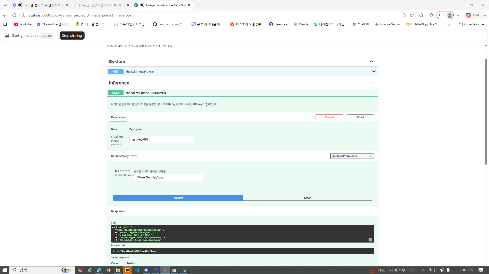
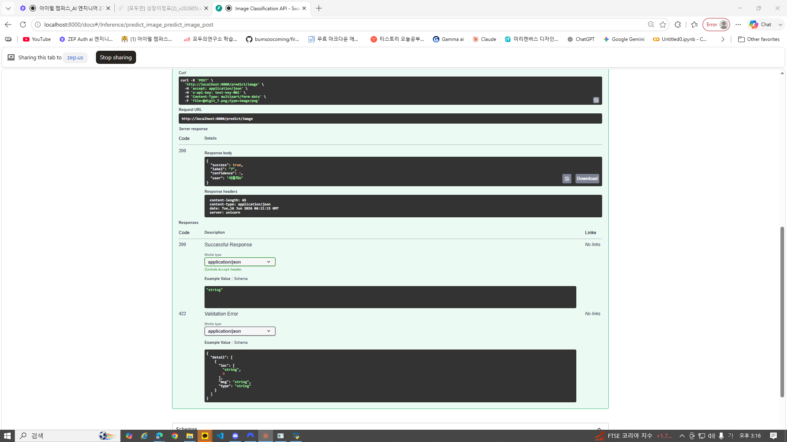

# Day 6 — 인증 및 미디어 처리 기초 실습 제출

> 작성자: 김범수
> 날짜: 2026-06-16
> 환경: Windows 10, Python 3.x (.venv), FastAPI + PyTorch
> 주제: API Key 인증 + 파일 업로드(UploadFile) + 이미지 분류 API

---

## 1. 프로젝트 실행 내역 및 설명

Day 5까지 만든 API는 **누구나 호출 가능**했습니다. Day 6에서는 **API Key 인증**을 붙이고,
정형 데이터(JSON)를 넘어 **이미지 파일 업로드(비정형 데이터)** 를 처리하는 API를 완성했습니다.

### 새로 만든 파일 (Day 6)
```
app/auth.py          — API Key 인증 (X-API-Key 헤더 검증, verify_api_key)
app/image_utils.py   — 파일 검증/리사이징 (validate_and_read_image)
app/image_api.py     — 인증 + 업로드 + MNIST 추론 통합 API
```

### 전체 파이프라인
```
POST /predict/image
  Headers: X-API-Key: test-key-001        1. API Key 인증
  Body: multipart/form-data (file)        2. 파일 검증 + 리사이징(28x28)
                                          3. 텐서 변환 + 정규화
                                          4. 모델 추론 (run_in_executor)
                                          5. 후처리 → JSON 응답
  ◀── {"success": true, "label": "7", "confidence": 1.0, "user": "사용자A"}
```

### 실행 결과 (섹션 6 통합 테스트)
| 테스트 | 조건 | 결과 |
|--------|------|------|
| 6.3 인증 없음 | X-API-Key 헤더 없음 | **401** ✅ |
| 6.4 잘못된 키 | X-API-Key: wrong | **401** ✅ |
| 6.5 올바른 키 + 이미지 | test-key-001 + digit_7.png | **200**, label "7", conf 1.0 ✅ |
| 6.6 잘못된 파일 형식 | 이미지가 아닌 파일 | **400** ✅ |
| 6.7 여러 이미지 연속 | 7/3/5 | 전부 200 (정답 일치) ✅ |

> ※ 백엔드 호환: 우리 `model_utils.predict()`가 `label`만 반환했으나, Day 6 `image_api`가
> `predicted_class`(문자열 클래스명)를 요구하여, `predict()` 반환값에 `predicted_class`를
> 추가했습니다. (기존 `label`은 유지 → Day 2~5 서버 그대로 동작)

### 6.8 Swagger UI 테스트 (필수 제출 항목)

브라우저 `http://localhost:8000/docs`에서 직접 테스트:
- `POST /predict/image` → Try it out
- `x-api-key`: `test-key-001`
- `file`: `digit_7.png` 업로드
- Execute → **200 OK**

**요청 설정 (x-api-key + file)**



**응답 결과 (200 + label "7" + user "사용자A")**



---

## 2. 섹션별 체크포인트 답변

### ✅ §1 체크포인트

**Q1. 인증 없는 API가 위험한 이유를 두 가지 이상 설명하세요.**

① **무단 사용·비용 폭탄**: URL만 알면 누구나 추론을 호출할 수 있어, GPU/서버 자원이 외부인에게 소모되고 비용이 새어 나갑니다.
② **남용·공격 노출**: 사용량 제한이나 추적이 불가능해 무한 호출(DoS)이나 스크래핑에 무방비입니다. 누가 무엇을 호출했는지 기록할 수도 없습니다.
③ (추가) **데이터/모델 보호 불가**: 유료여야 할 기능이나 민감한 모델이 그대로 공개됩니다.

**Q2. API Key 방식이 ML 추론 API에 적합한 이유는 무엇입니까?**

가장 간단하면서도 실무적으로 충분하기 때문입니다. 사용자 로그인(세션) 없이 **요청 헤더에 키 하나**만 넣으면 인증되고, 그 키로 **인증과 사용량 추적**을 동시에 할 수 있습니다. 그래서 OpenAI·Anthropic·Hugging Face 등 대부분의 ML API가 이 방식을 씁니다. (복잡도: API Key < JWT < OAuth)

---

### ✅ §2 체크포인트

**Q1. `Header(None)`에서 `None`은 어떤 상황에서 `x_api_key`에 들어갑니까?**

요청에 **`X-API-Key` 헤더가 아예 없을 때** 기본값 `None`이 들어갑니다. `Header(None)`은 "이 헤더는 선택적이며, 없으면 None"이라는 의미입니다. 그래서 코드에서 `if x_api_key is None:`으로 "헤더 누락"을 잡아 401을 반환할 수 있습니다. (만약 `Header(...)`로 필수 지정하면 누락 시 422가 납니다.)

**Q2. `Depends(verify_api_key)`를 엔드포인트에 추가하면 요청 처리 흐름이 어떻게 바뀝니까?**

엔드포인트 본문이 실행되기 **전에** `verify_api_key`가 먼저 실행됩니다. 인증에 성공하면 그 반환값(사용자 이름)이 `user` 파라미터에 주입되고 본문이 진행됩니다. 실패하면 `verify_api_key`가 401 예외를 던져 **본문은 실행되지 않고** 바로 에러 응답이 나갑니다. 즉, 인증이 일종의 "문지기"로 앞단에 끼어듭니다.

**Q3. 인증 실패 시 반환하는 HTTP 상태 코드 401의 의미는 무엇입니까?**

**401 Unauthorized** = "인증되지 않음". 요청자의 신원을 확인할 수 없거나(키 없음) 제공된 자격 증명이 유효하지 않다(잘못된 키)는 뜻입니다. "누구인지 모르니 들여보낼 수 없다"는 신호입니다. (참고: 신원은 확인됐지만 권한이 없을 때는 403 Forbidden을 씁니다.)

---

## 3. Day 6 요약

```
✅ API Key 인증의 필요성을 이해하고 구현 (auth.py)
✅ Depends()로 엔드포인트에 인증 적용
✅ UploadFile로 이미지 파일 업로드 구현
✅ 파일 크기/형식 검증, 이미지 리사이징 안전장치 구현 (image_utils.py)
✅ 인증 + 파일 업로드 + 모델 추론을 결합한 API 완성 (image_api.py)
✅ Swagger UI에서 인증 헤더 + 파일 업로드로 추론 검증 (6.8)
```

**가장 중요한 변화:** 누구나 부르던 API가, **인증된 사용자만** 이미지를 올려 추론받는 API가 되었습니다. 정형 데이터(JSON)를 넘어 **비정형 데이터(이미지 파일)** 처리의 기초를 익혔습니다.

**다음 — Day 7:** 비정형 데이터(이미지/텍스트) 기반 프로젝트 2
