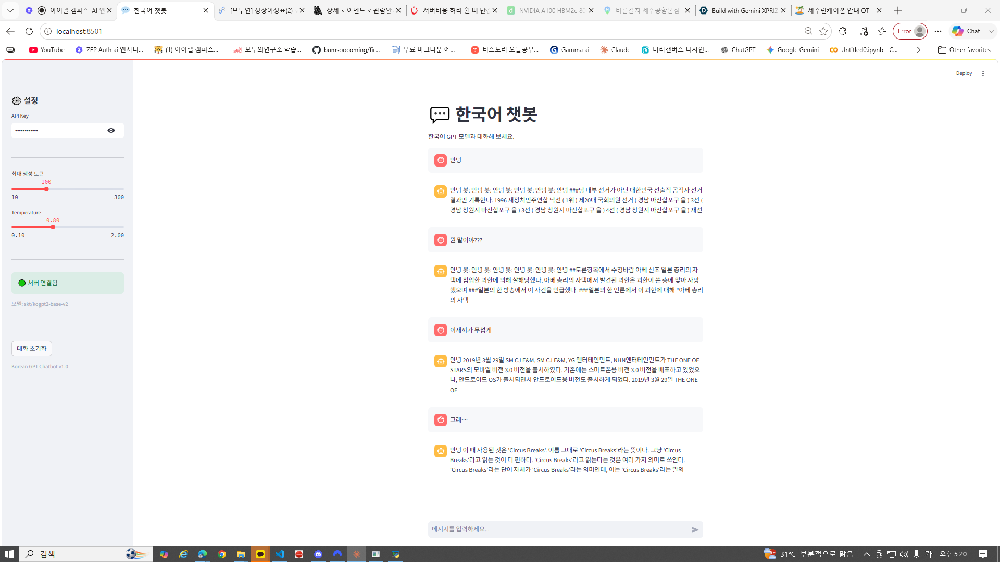

# Day 7 — [프로젝트 2] 트랜스포머 챗봇 서비스 제출

> 작성자: 김범수
> 날짜: 2026-06-18
> 환경: Windows 10, Python 3.x (.venv), FastAPI + Streamlit + Hugging Face Transformers
> 모델: `skt/kogpt2-base-v2` (한국어 GPT-2)

---

## 1. 프로젝트 실행 내역 및 설명

Day 1~6에서 익힌 모든 기술(직렬화·API·비동기·프론트엔드·인증)을 모아,
**한국어 GPT 모델을 서빙하는 멀티턴 챗봇 서비스**를 완성했습니다.

```
Streamlit (채팅 UI, 8501)
    ↓ HTTP (JSON + API Key)
FastAPI (인증 → 토크나이징 → 추론 → 디코딩, 8000)
    ↓
Hugging Face Transformers (skt/kogpt2-base-v2)
```

### 새로 만든 파일 (Day 7)
```
app/chatbot_model.py    — 모델 로드 + 텍스트 생성 (ChatbotModel)
app/chatbot_schemas.py  — 멀티턴 대화 스키마 (ChatRequest/ChatResponse)
app/chatbot_api.py      — 챗봇 FastAPI 서버 (인증 + 추론)
frontend/app_chatbot.py — Streamlit 채팅 UI (chat_message/chat_input)
```
> 인증(auth.py)·로깅·미들웨어·에러 핸들러는 Day 3·6에서 만든 것을 그대로 재사용.

### Day 5 vs Day 7
| | Day 5 (회귀) | Day 7 (챗봇) |
|---|---|---|
| 데이터 | 정형 (숫자 8개) | 비정형 (텍스트) |
| 모델 | PyTorch MLP | HF Transformer |
| 전처리 | 정규화(mean/std) | 토크나이저(BPE) |
| 후처리 | 숫자 → 가격 | 토큰 ID → 텍스트 |
| 인증 | 없음 | API Key |

### API 레벨 통합 테스트 (6.2 테스트 1~4)
| 테스트 | 결과 |
|--------|------|
| 1. 인증 | 인증없음 **401** / 잘못된키 **401** / 올바른키 **200** ✅ |
| 2. 멀티턴 대화 | 3턴 대화, 매 요청에 전체 기록 전송, 봇 응답 누적 ✅ |
| 3. 입력 검증 | 잘못된 입력 **422** ✅ |
| 4. 동시 요청 | `run_in_executor`로 동시 처리 ✅ |

### UI 테스트 (6.3) — 챗봇 대시보드

`http://localhost:8501` 한국어 챗봇에서 멀티턴 대화 검증:
- 사이드바: API Key(`test-key-001`), 서버 연결됨 🟢, 모델 `skt/kogpt2-base-v2`
- 여러 메시지 연속 입력 → 대화 기록 유지(session_state) → 봇 응답 생성



> ⚠️ `kogpt2`는 대화용으로 파인튜닝되지 않은 순수 생성 모델이라 응답이 다소 엉뚱할 수 있습니다.
> 이 프로젝트의 목표는 **응답 품질이 아니라 "챗봇 서비스 파이프라인"의 완성**입니다.
> (인증 + 멀티턴 + 트랜스포머 추론 + 프론트/백 분리가 모두 동작)

---

## 2. 섹션별 체크포인트 답변

### ✅ §1 체크포인트

**Q1. Day 5(정형 데이터)와 Day 7(텍스트 생성)에서 전처리가 어떻게 다릅니까?**
Day 5는 숫자 피처를 학습 통계(mean/std)로 **정규화(스케일 조정)** 했습니다. Day 7은 텍스트를 **토크나이저(BPE)** 로 잘게 쪼개 **토큰 ID 정수 배열**로 바꿉니다. 정형은 "값의 크기를 맞추는" 전처리, 비정형(텍스트)은 "글자를 모델이 이해하는 숫자로 바꾸는" 전처리입니다.

**Q2. Hugging Face Transformers 라이브러리의 역할은 무엇입니까?**
사전 학습된 트랜스포머 모델과 그에 맞는 토크나이저를 **다운로드·로드·추론**할 수 있게 해주는 라이브러리입니다. `from_pretrained()` 한 줄로 모델/토크나이저를 가져오고, `model.generate()`로 텍스트를 생성합니다. 모델 구현을 직접 안 짜도 됩니다.

---

### ✅ §2 체크포인트

**Q1. 토크나이저의 `encode()`와 `decode()`는 각각 어떤 변환을 수행합니까?**
`encode()`는 사람이 읽는 **텍스트 → 토큰 ID 정수 배열**(모델 입력)로 바꿉니다. `decode()`는 그 반대로 모델이 출력한 **토큰 ID → 텍스트**로 되돌립니다. 입력 인코딩과 출력 디코딩이 짝을 이룹니다.

**Q2. `model.generate()`의 `temperature` 파라미터는 생성 결과에 어떤 영향을 줍니까?**
다음 토큰을 고를 때의 **무작위성(다양성)** 을 조절합니다. 낮으면(예: 0.1) 가장 확률 높은 토큰만 골라 **보수적·반복적**인 응답이 나오고, 높으면(예: 1.5) 덜 확률적인 토큰도 골라 **다양하지만 엉뚱할 수 있는** 응답이 나옵니다.

**Q3. 멀티턴 대화에서 이전 대화 기록을 프롬프트에 포함하는 이유는 무엇입니까?**
모델은 기본적으로 **이전 대화를 기억하지 못합니다**(무상태). 맥락을 유지하려면 매 요청마다 지금까지의 대화 기록을 프롬프트에 함께 넣어줘야, 모델이 문맥을 보고 자연스럽게 이어서 답할 수 있습니다.

---

### ✅ §3 체크포인트

**Q1. `ChatRequest`의 `messages`가 리스트인 이유는 무엇입니까?**
멀티턴 대화는 사용자·봇이 주고받은 **여러 메시지의 순서 있는 기록**입니다. 리스트로 받아야 대화의 흐름(순서)을 그대로 담아 모델에 전달할 수 있습니다.

**Q2. 서버가 대화 기록을 저장하지 않고, 클라이언트가 매번 전체 기록을 보내는 이유는?**
**REST의 무상태(stateless) 원칙** 때문입니다. 서버가 대화 상태를 안 들고 있으면, 서버를 여러 대로 늘려도(확장) 아무 서버나 요청을 처리할 수 있고, 한 서버가 죽어도 대화가 끊기지 않습니다. 상태 관리는 클라이언트(또는 별도 저장소)의 몫입니다.

**Q3. `max_new_tokens`을 너무 크게 설정하면 어떤 문제가 발생할 수 있습니까?**
생성 시간이 길어져 **응답이 느려지고**, GPU/CPU 자원을 더 많이 쓰며, 모델 최대 길이를 초과할 위험이 커집니다. 또 작은 모델은 길게 생성할수록 **횡설수설(반복·이탈)** 이 심해집니다.

---

### ✅ §4·§5 체크포인트 (채팅 UI)

**Q1. `st.chat_message`와 `st.chat_input`은 각각 어떤 역할을 합니까?**
`st.chat_message(role)`은 말풍선 형태로 **대화 한 줄을 표시**(사용자/봇 구분)합니다. `st.chat_input()`은 화면 하단의 **채팅 입력창**으로, 엔터를 치면 입력값을 반환해 요청을 트리거합니다. 둘로 ChatGPT 스타일 UI를 몇 줄에 만듭니다.

**Q2. `st.session_state["chat_messages"]`에 대화 기록을 저장하는 이유는?**
Streamlit은 입력마다 스크립트를 재실행하므로 일반 변수는 사라집니다. 대화 기록을 `session_state`에 저장해야 **재실행 후에도 누적된 대화가 유지**되고, 매 요청에 전체 기록을 API로 보낼 수 있습니다.

**Q3. "대화 초기화" 버튼이 `st.rerun()`을 호출하는 이유는 무엇입니까?**
`session_state`의 대화 기록을 비운 뒤 `st.rerun()`으로 **스크립트를 즉시 다시 실행**해, 비워진 상태가 화면에 곧바로 반영되게 하기 위함입니다.

---

## 3. Day 7 최종 체크포인트

**Q1. Day 5와 Day 7의 전처리 방식 차이는?**
Day 5: 숫자 피처를 mean/std로 정규화. Day 7: 텍스트를 토크나이저(BPE)로 토큰 ID 배열로 변환. (정형=스케일 조정 / 비정형=토큰화)

**Q2. 멀티턴 대화에서 서버가 상태를 유지하지 않는 이유는?**
REST 무상태 원칙 — 확장성과 장애 복원력을 위해. 서버가 대화를 안 들고 있어야 여러 서버로 부하를 나눌 수 있고, 클라이언트가 매 요청에 전체 기록을 보냅니다.

**Q3. API Key가 잘못되면 서버는 어떤 상태 코드를 반환하고, UI는 어떻게 처리합니까?**
서버는 **401 Unauthorized**를 반환하고, UI는 이를 잡아 **"🔑 인증 실패"** 같은 안내 메시지를 띄웁니다. (내부 오류 노출 없이)

**Q4. temperature를 낮추면 생성 결과에 어떤 변화가 있습니까?**
무작위성이 줄어 **보수적이고 일관된(반복적인)** 응답이 나옵니다. 가장 확률 높은 토큰 위주로 선택하기 때문입니다.

**Q5. 이 서비스를 다른 컴퓨터에서 실행하려면 무엇이 필요합니까?**
① Python 환경 + `requirements.txt`의 패키지(transformers, torch, fastapi, streamlit 등), ② 코드(app/·frontend/), ③ 인터넷(최초 1회 Hugging Face 모델 다운로드, 이후 `~/.cache/huggingface`에 캐시). → 이런 환경 차이를 근본 해결하는 것이 **다음 Day 8의 Docker**입니다.

---

## 4. 프로젝트 회고

**잘 된 점**
- Day 1~6의 배포 골격(인증·비동기·에러처리·프론트/백 분리)이 **완전히 다른 태스크(텍스트 생성)에도 그대로 재사용**됐습니다. 모델과 데이터만 바뀌고 구조는 동일 — 잘 설계한 파이프라인의 가치를 다시 확인했습니다.
- `st.chat_message`/`st.chat_input` + `session_state`로 **멀티턴 채팅 UI**가 몇 줄에 완성됐습니다.

**어려웠던 점 / 배운 점**
- transformers 최신 버전(5.x)과 옛 모델(kogpt2)의 호환(safetensors, 경고 메시지)을 확인하는 과정이 필요했습니다.
- 멀티턴의 핵심은 **무상태 서버 + 클라이언트가 전체 대화 기록 전송**이라는 점을 코드로 체득했습니다.

**개선할 수 있는 점**
- kogpt2는 대화 파인튜닝이 안 돼 응답이 엉뚱 → **대화 데이터로 파인튜닝**하거나 더 큰 instruct 모델로 교체하면 품질 향상.
- 응답 스트리밍(토큰 단위 표시), 대화 길이 제한·요약 등으로 UX 개선 가능.

---

**가장 중요한 변화:** 숫자·이미지를 넘어 **텍스트 생성(LLM)** 까지 동일한 배포 골격으로 서빙했습니다. 다음 Day 8(Docker)에서 "내 컴퓨터에서는 되는데" 문제를 근본 해결합니다.
