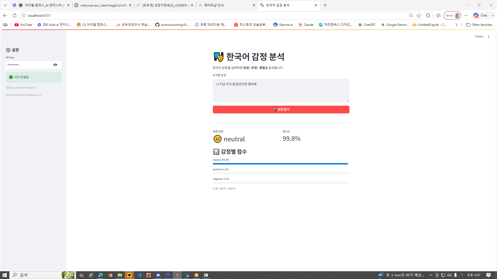

# Day 8 — [자율 프로젝트] 한국어 감정 분석 서비스 제출

> 작성자: 김범수
> 날짜: 2026-06-19
> 환경: Windows 10, Python 3.x (.venv), FastAPI + Streamlit + Hugging Face Transformers
> 모델: `snunlp/KR-FinBert-SC` (한국어 금융 감정 분류: positive / negative / neutral)

---

## 1. 프로젝트 개요 및 실행 내역

Day 1~7에서 배운 기술을 **교안 없이 스스로 조합**하여, 한국어 문장의 감정을 분석하는
서비스를 직접 설계·구현했습니다.

### 선택한 도메인/모델
- **도메인:** 한국어 감정 분석 (text-classification)
- **모델:** `snunlp/KR-FinBert-SC` — `pipeline()`으로 바로 사용, CPU에서 동작, 한국어 지원
- **선택 이유:** 입력이 텍스트 한 줄로 단순해 데모가 직관적이고, 사전학습 모델을 그대로 서빙하기 적합

### 아키텍처
```
Streamlit (감정분석 UI, 8501)
    ↓ HTTP (JSON + X-API-Key)
FastAPI (인증 → Pydantic 검증 → 비동기 추론, 8000)
    ↓ run_in_executor
Hugging Face pipeline (snunlp/KR-FinBert-SC)
```

### 구현 파일
```
app/auth.py          — API Key 인증 (Day 6 재사용)
app/schemas.py       — PredictRequest(text) / PredictResponse(label, confidence, scores)
app/model_service.py — load_model(pipeline) / predict
app/main.py          — FastAPI (/health, /predict + Depends(인증) + run_in_executor)
frontend/app.py      — Streamlit (텍스트 입력 → API 호출 → 감정/점수 표시)
```

### 실행 결과 (평가 기준 검증)
| 평가 기준 | 결과 |
|-----------|------|
| 서버 정상 실행 | ✅ `/health` → `{"status":"healthy","model":"snunlp/KR-FinBert-SC"}` |
| 추론 동작 | ✅ "주가가 크게 올랐습니다" → **positive (0.999)** |
| | ✅ "실적이 최악이라 폭락했다" → **negative (0.999)** |
| | ✅ "변동 없이 마감했다" → **neutral (1.000)** |
| API Key 없이 → 401 | ✅ 인증없음 401 / 잘못된키 401 |
| 잘못된 입력 → 422 | ✅ 빈 문자열 422 (Pydantic min_length=1) |
| Streamlit UI 동작 | ✅ 입력 → 감정 분석 → 점수 막대 표시 |

### 프론트엔드 데모 캡처



> 사이드바에 API Key·서버 상태·모델명, 본문에 입력창·예측 감정·확신도·감정별 점수 막대·인증 사용자가 표시됩니다.
> (KR-FinBert-SC는 금융 텍스트 특화 모델이라 일상 감정 문장은 neutral로 보는 경향이 있으며, 금융 문장에 대해 positive/negative를 정확히 분류합니다.)

---

## 2. Day 8 최종 체크포인트 답변

**Q1. 본인의 프로젝트에서 Pydantic 검증은 어떤 잘못된 입력을 막아줍니까?**
`PredictRequest`의 `text: str = Field(..., min_length=1, max_length=2000)`가 ① **빈 문자열**(min_length=1 → 422), ② **2000자 초과**의 비정상적으로 긴 입력, ③ **타입 오류**(text가 문자열이 아닌 경우)를 모델에 도달하기 전에 차단합니다. 덕분에 토크나이저가 빈 입력으로 깨지거나 메모리가 폭주하는 일을 막습니다.

**Q2. `Depends(verify_api_key)`를 제거하면 어떤 위험이 있습니까?**
인증이 사라져 **URL만 알면 누구나 추론을 호출**할 수 있습니다. ① 무단 사용으로 CPU/메모리 자원이 외부인에게 소모되고, ② 사용량 추적·제한이 불가능해 남용(대량 호출)이나 비용 폭탄에 무방비가 되며, ③ 누가 호출했는지 기록할 수 없습니다.

**Q3. `run_in_executor`를 사용한 이유는 무엇입니까?**
모델 추론은 CPU-bound 작업이라 `async` 핸들러에서 직접 실행하면 **이벤트 루프를 붙들어** 그동안 다른 요청과 헬스체크까지 모두 멈춥니다(Day 3의 함정). `run_in_executor`로 추론을 별도 스레드풀에 위임하면 루프가 자유로워져, 추론이 도는 중에도 동시 요청을 처리할 수 있습니다.

**Q4. Day 1~8 중 가장 많이 참고한 Day는 어디였습니까? 왜?**
**Day 5(housing_api)와 Day 6(image_api)** 입니다. FastAPI 서버에 `lifespan`으로 모델을 한 번 로드하고, `Depends(verify_api_key)`로 인증을 걸고, `run_in_executor`로 비동기 추론하는 **서버 골격 구조**가 그대로 재사용되기 때문입니다. 입력이 숫자(Day 5)·이미지(Day 6)에서 텍스트로 바뀌었을 뿐, 뼈대는 동일했습니다.

**Q5. 이 서비스를 실제로 배포하려면 추가로 무엇이 필요합니까?**
① **환경 재현**: `requirements.txt` + (다음 단계인) **Docker**로 패키징해 어떤 서버에서든 동일 실행, ② **클라우드 배포**(AWS/GCP)와 외부 접근용 도메인·HTTPS, ③ 실서비스용 **API Key 관리**(DB·환경변수)와 사용량 제한(rate limit), ④ **모니터링/로깅**(Prometheus·Grafana)과 CI/CD 자동 배포. → 이것이 다음 MLOps 과정의 내용입니다.

---

## 3. 프로젝트 회고

**Day 1~7 교안 없이 코드를 작성할 수 있었는가?**
서버 골격(FastAPI + lifespan + 인증 + run_in_executor)은 Day 5·6 패턴이 손에 익어 거의 막힘 없이 작성할 수 있었습니다. 8일간 같은 구조를 반복한 덕분에 "모델·데이터만 바꿔 끼우면 된다"는 감각이 생겼습니다.

**어떤 부분에서 교안을 다시 찾아봤는가?**
- Pydantic `Field` 검증 규칙(min/max_length) → Day 2·5
- `run_in_executor`로 추론을 떼어내는 구문 → Day 3
- Streamlit에서 에러 코드별 분기(401/422 안내) → Day 4·6
- 모델 출력 형태(pipeline `top_k=None`로 전체 점수 받기) → 모델 문서 확인

**다음에 다시 만든다면 무엇을 다르게 하겠는가?**
- 모델 선택 시 **도메인 적합성**을 먼저 확인하겠습니다. KR-FinBert-SC는 금융 특화라 일상 문장엔 neutral 편향이 있었습니다 — 범용 감정 모델을 골랐으면 데모가 더 직관적이었을 것입니다.
- 응답에 처리 시간·모델 버전을 포함하고, 로깅/미들웨어(Day 3)를 붙여 운영 관점을 강화하겠습니다.

---

## 4. 8일간의 여정 정리

```
Day 1: 모델 직렬화        → "저장하고 불러온다"
Day 2: FastAPI + Pydantic → "API로 감싼다"
Day 3: 비동기 + 에러/로깅  → "안정적으로 돌린다"
Day 4: Streamlit          → "누구나 쓰게 한다"
Day 5: 정형 데이터 프로젝트 → "따라하며 조립한다"
Day 6: 인증 + 파일 업로드  → "보안·비정형을 다룬다"
Day 7: 챗봇(텍스트 생성)   → "패턴을 반복한다"
Day 8: 자율 프로젝트       → "스스로 만든다" ✅
```

**가장 중요한 성과:** 사전학습 모델을 **인증·검증·비동기·UI까지 갖춘 완결된 서비스**로 스스로 서빙할 수 있게 되었습니다. 다음은 Docker·CI/CD로 가는 **MLOps**입니다.
